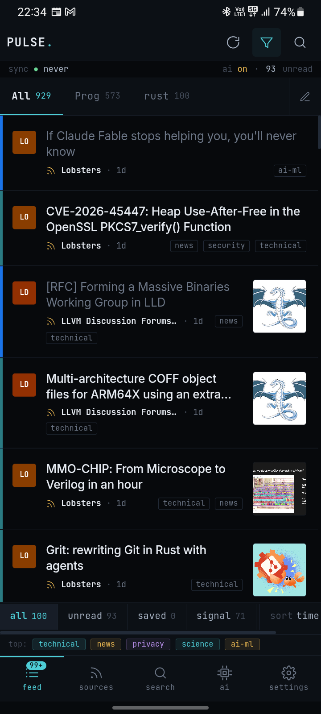
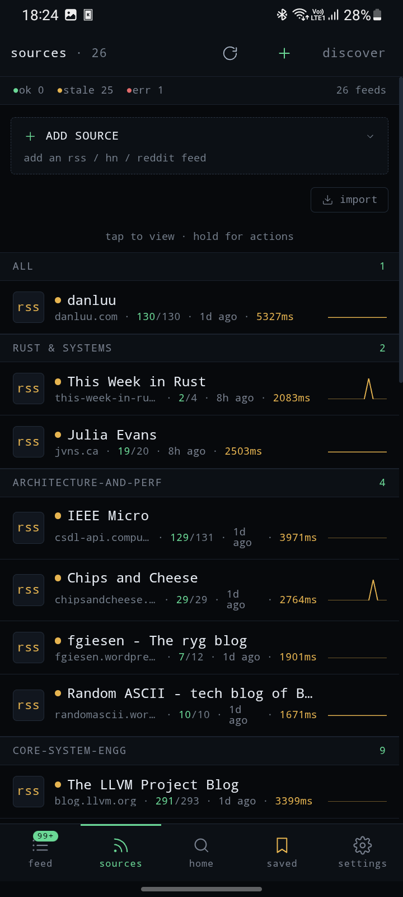
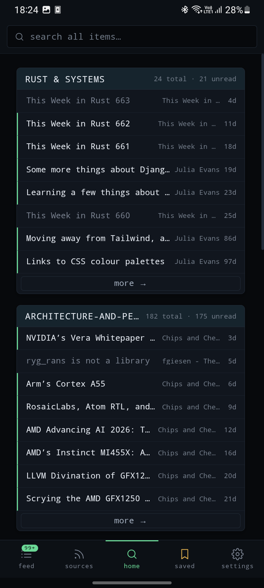
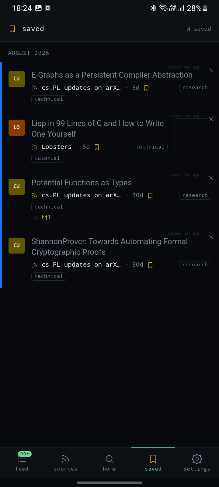
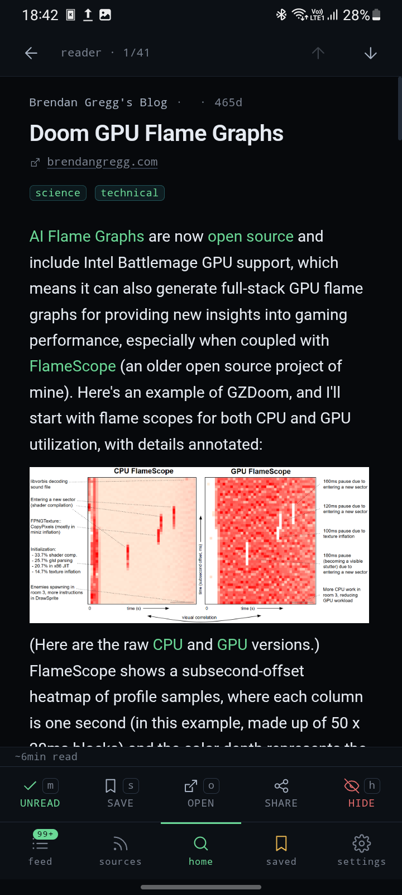

#  Pulse

<!--toc:start-->
- [Pulse](#pulse)
  - [Screenshots](#screenshots)
  - [Features](#features)
  - [Getting started](#getting-started)
  - [Platform support](#platform-support)
  - [Tags](#tags)
  - [Documentation](#documentation)
  - [Data & privacy](#data--privacy)
  - [License](#license)
<!--toc:end-->

[](https://www.rust-lang.org/)
[](https://tauri.app/)
[](https://kit.svelte.dev/)
[](#platform-support)

A local-first feed reader that brings Hacker News, Reddit, and your favorite RSS/Atom feeds into one fast, curated, cross-platform app. **No cloud, no telemetry, no account.**

Everything runs on your device. Your feeds, your reads, and your library all live in a local SQLite database — nothing is ever uploaded.

---

## Screenshots

| Feeds                                                                        | Sources                                                                      |
| ---------------------------------------------------------------------------- | ---------------------------------------------------------------------------- |
| [](./docs/screenshots/01-feeds.png)      | [](./docs/screenshots/02-sources.png)  |
| Home / Overview                                                              | Saved (by save-month)                                                         |
| [](./docs/screenshots/03-home.png)        | [](./docs/screenshots/04-saved.png)      |
| Reader                                                                       |
| [](./docs/screenshots/05-reader.png)    |

---

## Features

**Feeds & sources**

- Hacker News, Reddit subreddits, and any RSS/Atom feed
- Source grouping with per-feed sync status and health indicators (success rate, latency, failure streak)
- ETag/Last-Modified caching and exponential backoff (60s → 4h) for failing feeds
- Cursor-based pagination — loads fast regardless of database size

**Discovery**

- **68-feed curated catalog** for onboarding, grouped by category (Rust & Systems, Security, Compilers & PL, …)
- **Feed preview** before subscribing — see a feed's current items without adding it
- Bulk import from a JSON export (`feed import-json`)
- Android: share any URL from any app → Pulse detects the feed (YouTube, GitHub, Substack, Medium, …) and opens an add-feed sheet

**Home & Overview**

- The search tab is a **Home** screen: a global search bar plus a grid of per-group cards with recent items, total/unread counts, and one-tap drill-in
- Desktop shell toggles between **Overview** and **Feeds** in the left rail

**Reading**

- Distraction-free reader with sanitized HTML body
- Feed-body links open **externally** (never in the webview) with hover/long-press **URL preview**
- Relative feed-image URLs are resolved at ingestion (http media → https)
- Keyboard navigation (j/k, m, s, o, x, /, ?) on desktop

**Saved**

- Save items with an optional note; the Saved view is **grouped by the month you saved them** (newest saved first)

**Search**

- Full-text search across the entire database (SQLite FTS5), not just the loaded page

**Sync & health**

- Per-feed background sync tasks with exponential backoff and health tracking (failure streak, EMA latency)
- Feeds that fail repeatedly are surfaced in the UI and disabled after 10 consecutive failures

**Privacy**

- Local-first by design: data lives in a single SQLite file on your device
- No accounts, no cloud sync, no analytics, no telemetry

---

## Getting started

**Prerequisites:** Rust 1.95+, Node.js 22+, pnpm, Tauri CLI v2

```bash
# Clone
git clone https://github.com/80avin/pulse-rs
cd pulse-rs

# Install frontend deps
pnpm install

# Desktop dev server (hot reload)
pnpm tauri dev

# Desktop release build
pnpm tauri build

# Android APK (requires Android SDK + NDK)
pnpm tauri android build
```

**Frontend only:**

```bash
pnpm dev            # Vite dev server (port 1420)
pnpm build          # production SvelteKit build
pnpm check          # svelte-check (types + templates)
```

**Rust:**

```bash
cargo build -p pulse-cli          # CLI only
cargo test -p pulse-core          # core unit tests
cargo clippy --all                # lint
cargo fmt --all                   # format
```

**CLI** (useful for backend testing without the UI — always pass `--data-dir` on a dev machine):

```bash
cargo build -p pulse-cli
./target/debug/pulse --data-dir .pulse-data feed list
./target/debug/pulse --data-dir .pulse-data feed add https://example.com/feed.xml --group tech
./target/debug/pulse --data-dir .pulse-data feed preview https://lobste.rs/rss   # preview without subscribing
./target/debug/pulse --data-dir .pulse-data sync run --feed <id>
./target/debug/pulse --data-dir .pulse-data timeline
./target/debug/pulse --data-dir .pulse-data search "rust async"
./target/debug/pulse --data-dir .pulse-data db stats
```

---

## Platform support

| Platform | Status |
| -------- | ------ |
| Linux    | ✅     |
| Android  | ✅ APK |

---

## Tags

A small deterministic on-device rule engine adds useful filters to the timeline — e.g. `show-hn`, `paywall`, `security`. **No models, no downloads.** Tags are a supporting feature for filtering noise; the app is a feed reader first. See [docs/tagging.md](docs/tagging.md).

---

## Documentation

- [docs/architecture.md](docs/architecture.md) — system architecture
- [docs/data-model.md](docs/data-model.md) — storage schema and query patterns
- [docs/cli-ux.md](docs/cli-ux.md) — CLI reference
- [docs/tagging.md](docs/tagging.md) — the rule-based tag vocabulary

---

## Data & privacy

All data is stored locally in SQLite:

- Linux/macOS: `$XDG_DATA_HOME/pulse` (fallback `~/.local/share/pulse`)
- Windows: `%APPDATA%\pulse`
- Android: app-private data directory (survives updates)

No accounts, no cloud sync, no analytics, no telemetry.

---

## License

MIT
