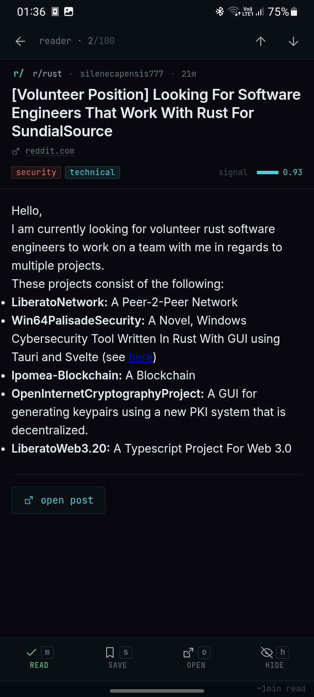
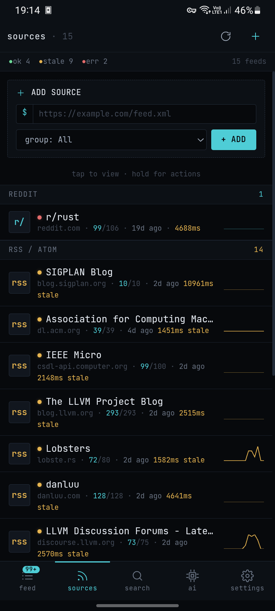
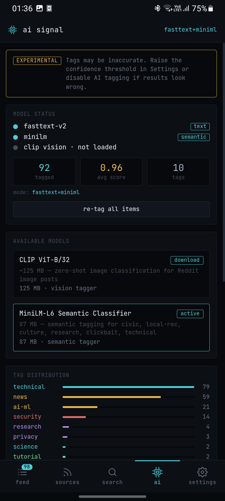

# Pulse

[](https://www.rust-lang.org/)
[](https://tauri.app/)
[](https://kit.svelte.dev/)
[](#platform-support)

A local-first feed reader with on-device AI filtering. Built for people who know what they want to read and are tired of algorithmic noise.

Pulse aggregates Hacker News, Reddit, and RSS feeds, then tags and filters posts with a deterministic on-device rule engine — no cloud, no telemetry, no subscription.

---

## Screenshots

| Feed                                                                        | Reader                                                                    |
| --------------------------------------------------------------------------- | ------------------------------------------------------------------------- |
| [](./docs/screenshots/01-feeds.png)     | [](./docs/screenshots/02-reader.png) |
| Sources                                                                     | Manage AI                                                                 |
| [](./docs/screenshots/03-sources.png) | [](./docs/screenshots/04-ai.png)         |

---

## Features

**Feeds**

- Hacker News, Reddit subreddits, and any RSS/Atom feed
- Source grouping, per-source sync status and health indicators
- Cursor-based pagination — loads fast regardless of database size
- Full-text search across the entire database (SQLite FTS5)
- og_image thumbnails, crosspost detection, score/comment metadata

**Tagging** _(on-device, deterministic)_

- On-device only — nothing leaves your device; no models, no downloads
- Rule engine: structural rules (`show-hn`, `ask-hn`, `job-posting`, `paywall`, `video`, `low-effort`) + keyword/regex semantic rules (`technical`, `research`, `ai-ml`, `security`, `news`, `clickbait`, …)
- Tags are _filters_, not categories — designed to let you exclude noise, not just label subjects
- 20 tags: structural, semantic, and community (`civic`, `local-rec`, `culture`, `marketplace`)

**Android**

- Share any URL from any app → Pulse detects the feed and shows an add-feed sheet
- Detects YouTube channels/playlists, GitHub repos, Substack, Medium, Dev.to, and generic RSS/Atom without leaving the app

**Reader**

- Distraction-free reader view with sanitized HTML body
- Keyboard navigation (j/k, m, s, o, ?)
- Mark read on open, save for later, hide

---

## Platform support

| Platform | Status |
| -------- | ------ |
| Linux    | ✅     |
| Android  | ✅ APK |

---

## Building

**Prerequisites:** Rust 1.95+, Node.js 22+, pnpm, Tauri CLI v2

```bash
# Clone
git clone https://github.com/80avin/pulse-rs
cd pulse-rs

# Install frontend deps
pnpm install

# Desktop dev server (hot reload)
pnpm tauri dev

# Desktop release build
pnpm tauri build

# Android APK (requires Android SDK + NDK)
pnpm tauri android build
```

**CLI only** (useful for backend testing without the UI):

```bash
cargo build -p pulse-cli
./target/debug/pulse --data-dir .pulse-data feed list
./target/debug/pulse --data-dir .pulse-data sync run --feed-id <id>
./target/debug/pulse --data-dir .pulse-data timeline
```

---

## AI tagging

Tags are produced by a deterministic rule engine — no models, no downloads, no confidence thresholds. Tune the rules in `pulse-core/src/ai/rules.rs`; run `pulse ai rules list` to inspect them and `pulse ai run` to re-tag.

The goal of the tagging system is **spam filtering**, not subject classification. Tags exist to answer the question: _"Is this the kind of post I want to see?"_ — not _"What is this post about?"_

A post can be correctly identified as being about technology and still be low-effort noise. The tagger is designed to surface those distinctions:

| Tag           | Fires on                             | Skips                             |
| ------------- | ------------------------------------ | --------------------------------- |
| `low-effort`  | Single-word titles, score ≤ −3       | Any post with substantive content |
| `local-rec`   | "Best dentist in [city]?"            | "Help with anything?"             |
| `marketplace` | "Selling my laptop — ₹40k"           | News, complaints, art             |
| `civic`       | "Power outage — no water for 3 days" | Travel, food, marketplace         |
| `clickbait`   | "You won't believe what X did"       | Straightforward news              |

Lazy or vague posts get no tags. **The absence of a tag is itself a filter signal.** If you filter your feed to only show `technical` or `research` posts, everything without those tags is implicitly excluded.

Full tag reference and pipeline details: [CLAUDE.md](CLAUDE.md#tagging-pipeline)

---

## Architecture

```
pulse-core/   — all business logic; no platform I/O assumptions
pulse-cli/    — thin CLI for scripting and backend testing
src-tauri/    — Tauri shell: IPC commands, Android bridge
src/          — SvelteKit 5 UI
```

Pulse uses a single-writer actor for all SQLite writes (WAL mode), a bounded async tagger queue, and cursor-based timeline pagination. The Tauri IPC layer is a thin mapping from Tauri commands to `PulseCore` methods — no business logic lives in the shell.

See [CLAUDE.md](CLAUDE.md) for the full architecture reference.

---

## Data & privacy

All data is stored locally in SQLite:

- Linux: `~/.local/share/pulse/`
- Android: app-private data directory (survives updates)

No accounts, no sync, no analytics.

---

## License

MIT
